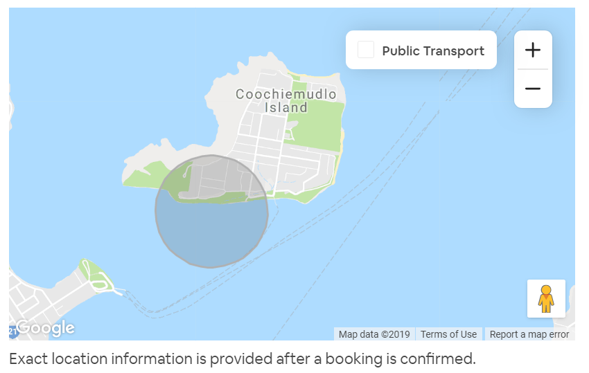

<!-- ------------------------------------------------------------ --> 

```{r setup, include=FALSE}
knitr::opts_chunk$set(echo = FALSE, message = FALSE, warning = FALSE, 
                      cache = FALSE,
                      fig.align="center",
                      fig.pos="H",
                      dpi = 300)

knitr::opts_knit$set(root.dir = rprojroot::find_rstudio_root_file())

set.seed(12345)
options(scipen = 999)

library(pacman) 
p_load(tidyverse, magrittr, lubridate, scales, janitor, imputeTS,
       sf, tmap, tmaptools, 
       sjmisc, kableExtra)

tmap_mode("plot")
```

<!-- ------------------------------------------------------------ --> 

# SA2 areas

```{r geodata_load, include=FALSE}
# SA2
SA2 <- readRDS(file = "./data/geo/SA2_2016_AUST_clean.rds") %>% 
  filter(! SA2_5DIG16 %in% c("91001", "91002", "91004", "11161")) %>% 
  select(-starts_with("SA3")) %>% 
  select(-starts_with("SA1")) %>% 
  select(-AREASQKM16) %>%
  mutate(STE_CODE16 = as.numeric(as.character(STE_CODE16))) %>% 
  mutate(SA2_MAIN16 = as.numeric(as.character(SA2_MAIN16))) %>% 
  mutate(SA2_5DIG16 = as.numeric(as.character(SA2_5DIG16))) %>% 
  mutate(SA4_CODE16 = as.numeric(as.character(SA4_CODE16))) 

# centroids from arcgis - with option 'inside'
SA2_centr <- st_read("./data/geo/1270055001_sa2_2016_aust_shape/SA2_2016_AUST_centr_inside.shp",
                     stringsAsFactors = FALSE) %>% 
  filter(! SA2_5DIG16 %in% c("91001", "91002", "91004", "11161")) %>% 
  select(-starts_with("SA3")) %>% 
  select(-starts_with("SA1")) %>% 
  select(-AREASQKM16) %>%
  mutate(STE_CODE16 = as.numeric(as.character(STE_CODE16))) %>% 
  mutate(SA2_MAIN16 = as.numeric(as.character(SA2_MAIN16))) %>% 
  mutate(SA2_5DIG16 = as.numeric(as.character(SA2_5DIG16))) %>% 
  mutate(SA4_CODE16 = as.numeric(as.character(SA4_CODE16))) 

# SA4
SA4 <- readRDS(file = "./data/geo/SA4_2016_AUST_clean.rds") %>% 
  select(-AREASQKM16) %>%
  mutate(STE_CODE16 = as.numeric(as.character(STE_CODE16))) %>% 
  mutate(SA4_CODE16 = as.numeric(as.character(SA4_CODE16))) 

# centroids from arcgis - with option 'inside'
SA4_centr <- st_read("./data/geo/1270055001_sa4_2016_aust_shape/SA4_2016_AUST_centr_inside.shp",
                     stringsAsFactors = FALSE) %>% 
  select(-AREASQKM16) %>%
  mutate(STE_CODE16 = as.numeric(as.character(STE_CODE16))) %>% 
  mutate(SA4_CODE16 = as.numeric(as.character(SA4_CODE16))) 

# STATES
STE <- readRDS(file = "./data/geo/STE_2016_AUST_clean.rds") %>%  
  mutate(STE_CODE16 = as.numeric(as.character(STE_CODE16))) 

```

The study area consists of `r comma(nrow(SA2))` SA2 areas. 

```{r, fig.height = 6 , fig.width = 4.5 , fig.cap = "Study area"}
tm_shape(SA2) +
  tm_borders(lwd = 0.5) +
  tm_shape(STE) +
  tm_borders(col = "grey20", lwd = 1.5)  +
  tm_layout(title = "Study area",
            title.size = 0.66,
            title.position = c("right", "top")) +
  tm_credits("Geodata (c) ABS", position=c("RIGHT", "BOTTOM"), size = 0.5)
```

4 remote areas have been excluded.

```{r}
readRDS(file = "./data/geo/SA2_2016_AUST_clean.rds") %>% 
  filter(SA2_5DIG16 %in% c("91001", "91002", "91004", "11161")) %>% 
  st_drop_geometry() %>% 
  select(SA2_NAME16, STE_NAME16)
```

<!-- ------------------------------------------------------------ --> 

# Airdna data

## Geographic coordinates

Locations of individual Airbnb properties (points) are specified by geographic coordinates. They were linked to [ABS data of SA2 areas from 2016](https://www.abs.gov.au/AUSSTATS/abs@.nsf/Lookup/1270.0.55.001Main+Features10018July%202016?OpenDocument). Spatial join in ArcGIS was used with `CLOSEST` option to capture locations that did not overlap with polygons (due to privacy reasons, locations are not exact). 



## Raw data

```{r, include=FALSE}
monthly_new_select <- readRDS("data/airdna/clean/monthly_new_select.Rds") 
```

## Listings 

```{r include=FALSE}
monthly_new_prep <- monthly_new_select %>% 
  filter(! SA2_5DIG16 %in% c("91001", "91002", "91004", "11161")) %>% 
 select(-starts_with("SA3")) %>% 
  select(-starts_with("SA1"))

rm(monthly_new_select)
gc()
```

Selection of records from all of Australia results in a dataset of `r comma(length(unique(monthly_new_prep$property_id)))` properties and `r comma(nrow(monthly_new_prep))` monthly stats. 

## Starting in 2016-07-01

`r comma(nrow(filter(monthly_new_prep, reporting_month < ymd("2016-07-01"))))` data points from before 2016-07-01 were excluded.

```{r}
monthly_new_prep %<>% 
  filter(reporting_month >= ymd("2016-07-01"))
```

## Inactive listings

Over 40% of monthly records is labelled as not active. 

```{r}
frq(monthly_new_prep, active, sort.frq = "desc") 
```

```{r include=FALSE}
# temp <- monthly_new_prep %>% 
#   filter(active == FALSE) %>% 
#   select(-active)

temp1 <- monthly_new_prep %>% 
  filter(active == FALSE) %>% 
  select(-active) %>% 
  filter(!is.na(revenue_usd) | !is.na(revenue_native)) %>% 
  filter(revenue_usd > 0 | revenue_native > 0)

temp2 <- monthly_new_prep %>% 
  filter(active == FALSE) %>% 
  select(-active) %>% 
  filter(available_days > 0 )
```

All of them were excluded. 

That also applied to records where there was some information about the revenue (either AUD or USD; n = `r comma(nrow(temp1))`) or number of available days was indicated to be > 0 (n = `r comma(nrow(temp2))`). For the former group, that could indicate some reshuffling of money from previous months? For the latter group - this doesn't make sense but at least none of these records has any reservations.  

```{r include=FALSE}
monthly_new_prep %<>% 
  filter(active == TRUE) %>%
  select(-active) %>%
  tidyr::replace_na(list(revenue_native = 0))

rm(temp1, temp2)
```

## Missing information on number of bedrooms

`r comma(nrow(monthly_new_prep %>% filter(is.na(bedrooms))))` records of `r comma(nrow(monthly_new_prep %>% filter(is.na(bedrooms)) %>% select(property_id) %>% distinct()))` properties with missing information on number of bedrooms were excluded. Almost two thirds of them have missing information on `property_type` and many of the remaining belong to unusual catoegories of accomodation.

```{r}
temp <- monthly_new_prep %>%
  group_by(property_id) %>%
  filter(row_number() == 1) %>%
  ungroup() %>%
  filter(is.na(bedrooms))

frq(temp, property_type)

monthly_new_prep %<>% 
  filter(!is.na(bedrooms))
```

## Properties with 4+ bedrooms

`r comma(nrow(monthly_new_prep %>% filter(bedrooms >= 4)))` records of `r comma(nrow(monthly_new_prep %>% filter(bedrooms >= 4) %>% select(property_id) %>% distinct()))` properties with 4 or more bedrooms were combined  into one group

```{r}
monthly_new_prep %<>% 
  mutate(bedrooms_orig = bedrooms) %>% 
  mutate(bedrooms = ifelse(bedrooms >= 4, 4, bedrooms))

temp <- monthly_new_prep %>%
  group_by(property_id) %>%
  filter(row_number() == 1) %>%
  ungroup() 

# frq(temp, bedrooms_orig)
# frq(temp, bedrooms)

frq(monthly_new_prep, bedrooms)
frq(temp, bedrooms)
```

Monthly records

```{r}
frq(monthly_new_prep, bedrooms) 
```

Properties

```{r}
frq(temp, bedrooms) 
```

## Listing type

Monthly records

```{r}
frq(monthly_new_prep, listing_type, sort.frq = "desc") 
```

Properties

```{r}
frq(temp, listing_type, sort.frq = "desc") 
```

## Property type

Analysed properties come in different flavours:

Monthly records

```{r}
frq(monthly_new_prep, property_type, sort.frq = "desc") 
```

Properties

```{r}
frq(temp, property_type, sort.frq = "desc") 
```

Classification of properties was simplified to `House` and `Unit` whenever possible:

```{r}
property_type <- readRDS("data/airdna/clean/property_type") %>% 
  select(property_type, property_type_new) %>% 
  tidyr::replace_na(list(property_type_new = ""))

property_type %>% 
  print(n = Inf)

monthly_new_prep %<>% 
  left_join(property_type) %>% 
  tidyr::replace_na(list(property_type_new = ""))
```

Frequency of new classification:

```{r}
temp <- monthly_new_prep %>% 
  group_by(property_id) %>% 
  filter(row_number() == 1) %>% 
  ungroup()

frq(monthly_new_prep, property_type_new, sort.frq = "desc") 
frq(temp, property_type_new, sort.frq = "desc") 
```

```{r eval=FALSE, include=FALSE}
monthly_new_prep %>%
  tabyl(listing_type, property_type_new) %>%
  adorn_totals(c("row", "col")) %>%
  adorn_percentages("row") %>%
  adorn_pct_formatting(digits = 0) %>%
  adorn_ns() %>%
  knitr::kable()
```

## Monthly data availability

```{r}
temp <- monthly_new_prep %>% 
  group_by(property_id) %>% 
  summarize(number_monthly_records = n()) %>% 
  ungroup()
```

Listings have varying amount of monthly records. That can range from `r min(temp$number_monthly_records)` to `r max(temp$number_monthly_records)` with median number being `r number(median(temp$number_monthly_records))`

```{r}
frq(temp, number_monthly_records) 

descr(temp, number_monthly_records) 

ggplot(temp, aes(number_monthly_records)) + geom_histogram(binwidth = 1)
```

<!-- ------------------------------------------------------------ --> 

# SA2 areas with no Airbnb data

`r nrow(filter(SA2, !SA2_MAIN16 %in% unique(monthly_new_prep$SA2_MAIN16)))` SA2s have no Airbnbs inside. 

```{r}
temp <- SA2 %>% 
  filter(!SA2_MAIN16 %in% unique(monthly_new_prep$SA2_MAIN16))
```

```{r}
temp %>%
  st_drop_geometry() %>% 
  select(SA2_NAME16, SA4_NAME16, GCC_NAME16) %>% 
  # knitr::kable()
  print()
```

```{r, fig.height = 8 , fig.width = 6 , fig.cap = "SA2 areaas with no Airbnb listings"}
tm_shape(STE) +
  tm_borders(col = "grey20", lwd = 1.5)  +
  tm_shape(temp) +
  tm_fill(col = "red", border.col = "white", alpha = 0.5, labels = "SA2_NAME16") +
  tm_shape(temp) +
  tm_text(size = 0.5, text = "SA2_NAME16", remove.overlap = TRUE)

```

<!-- ------------------------------------------------------------ --> 

```{r}
saveRDS(monthly_new_prep, "TMR/data/monthly_new_prep.Rds")
```


